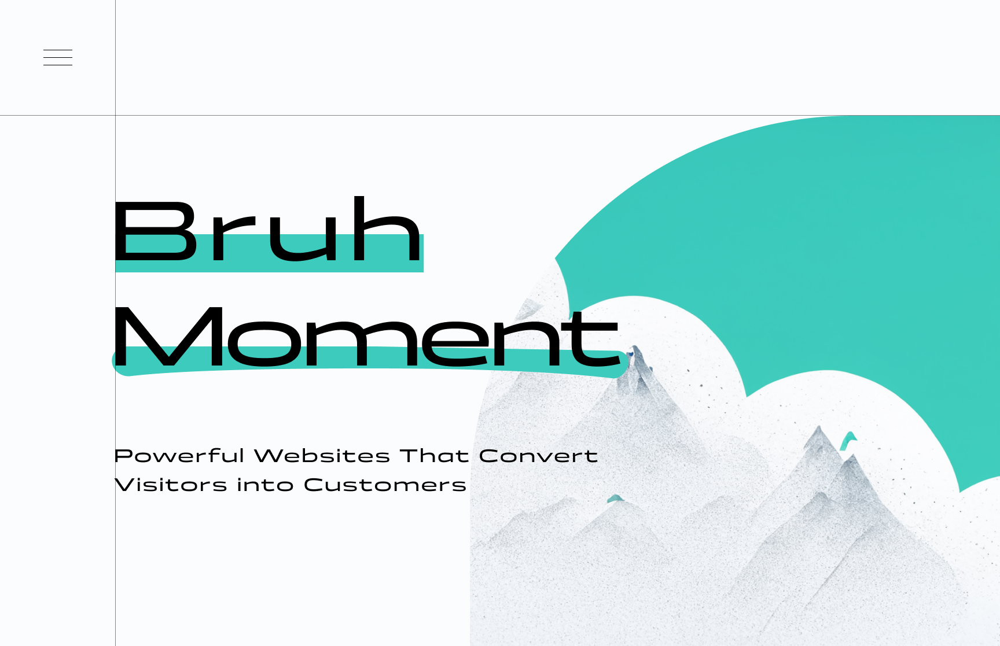

# PLAYGROUND
hi there

# Bruh Moment
i didnt like the desgin i made so i didnt animate it

# Three hover

# Youtube Ui Clone kinda idk

---

# Gsap scroll testing
i was trying to see how they made this website https://www.sendpotion.com/ 
cuberto just hits different :)
the framerate is kinda garbge for gifs but its smoother on the website HEHHEHE HA

---

# Cursor thingy
also from cuberto 

---

# Google classroom sidebar and navbar
idk i felt like making my version HEHE

